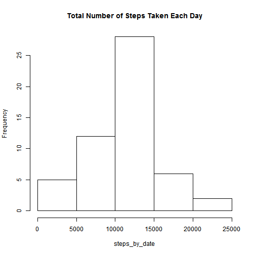
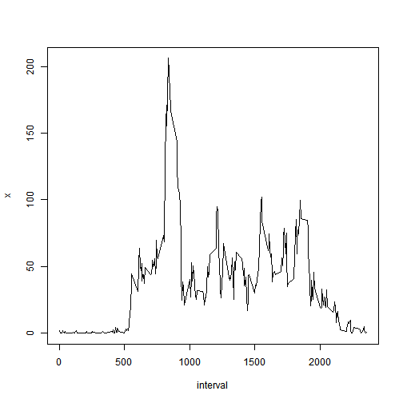
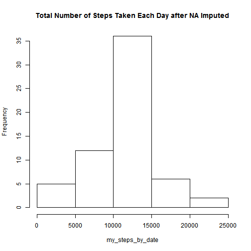
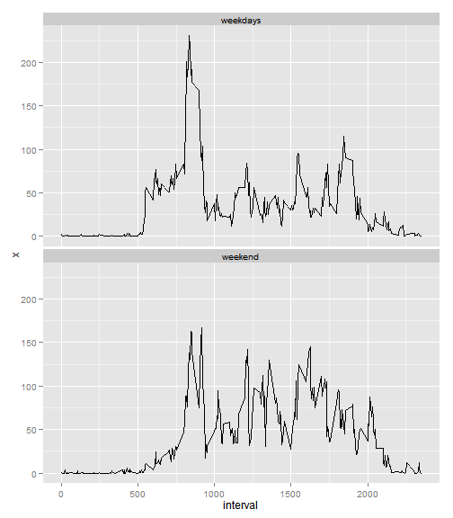

# Reproducible Research: Peer Assessment 1

<!-- ```{r setoptions,echo=FALSE,results="hide"}
 opts_chunk$set(cache=TRUE)
```
 -->
 ## Loading and preprocessing the data

```r
setwd("~/class/repdata-002/RepData_PeerAssessment1")
unzip("activity.zip")
activity <- read.table(unz("activity.zip", "activity.csv"), header = TRUE, sep = ",")
activity$date <- as.Date(activity$date)
```

## What is mean total number of steps taken per day?

```r
steps_by_date <- with(activity, rowsum(steps, date))
hist(steps_by_date, main = "Total Number of Steps Taken Each Day")
```

 

### The mean total number of steps taken per day    

```r
mean(steps_by_date, na.rm = T)
```

```
## [1] 10766
```

### The median total number of steps taken per day

```r
median(steps_by_date, na.rm = T)
```

```
## [1] 10765
```

## What is the average daily activity pattern?
### A time series plot of the 5-minute interval (x-axis) and the average number of steps taken, averaged across all days (y-axis)

```r
mean_steps_by_interval <- aggregate(activity$steps, by = list(interval = activity$interval), 
    FUN = mean, na.rm = T)
with(mean_steps_by_interval, plot(interval, x, type = "l"))
```

 

### The 5-minute interval, on average across all the days in the dataset, contains the maximum number of steps

```r
mean_steps_by_interval[which.max(mean_steps_by_interval[, 2]), 1]
```

```
## [1] 835
```

## Imputing missing values using the mean for that 5-minute interval

```r
my_act <- merge(activity, mean_steps_by_interval, by = "interval", all.x = T)
missIndex <- is.na(my_act$steps)
my_act[missIndex, 2] <- my_act[missIndex, 4]
```

### Mean total number of steps taken per day after NA imputed

```r
my_steps_by_date <- with(my_act, rowsum(steps, date))
hist(my_steps_by_date, main = "Total Number of Steps Taken Each Day after NA Imputed")
```

 

### The mean total number of steps taken per day

```r
mean(my_steps_by_date, na.rm = T)
```

```
## [1] 10766
```

### The median total number of steps taken per day

```r
median(my_steps_by_date, na.rm = T)
```

```
## [1] 10766
```

### The 2nd time series plot of the 5-minute interval (x-axis) and the average number of steps taken, averaged across all days (y-axis)

```r
my_mean_steps_by_interval <- aggregate(my_act$steps, by = list(interval = my_act$interval), 
    FUN = mean, na.rm = T)
with(my_mean_steps_by_interval, plot(interval, x, type = "l"))
```

 

### The 5-minute interval, on average across all the days in the dataset, contains the maximum number of steps

```r
my_mean_steps_by_interval[which.max(my_mean_steps_by_interval[, 2]), 1]
```

```
## [1] 835
```

### Comparision conclusion
#### Do these values differ from the estimates from the first part of the assignment?
These values are identical to the prior except the median, which has a little bit difference.
#### What is the impact of imputing missing data on the estimates of the total daily number of steps?
It seems the impact is rather small.
## Are there differences in activity patterns between weekdays and weekends?


```r
my_act$week <- factor(weekdays(as.Date(my_act$date)) %in% c("Saturday", "Sunday"), 
    c("FALSE", "TRUE"), c("weekdays", "weekend"))
my_mean_steps_by_interval_week <- aggregate(my_act$steps, by = list(interval = my_act$interval, 
    week = my_act$week), FUN = mean, na.rm = T)
library(ggplot2)
g <- ggplot(my_mean_steps_by_interval_week, aes(x = interval, y = x))
g + geom_line() + facet_wrap(~week, ncol = 1)
```

 

